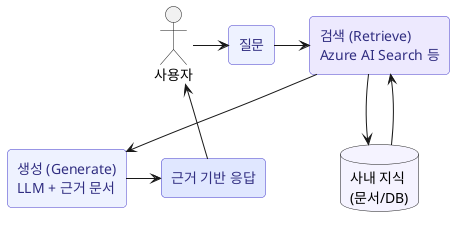
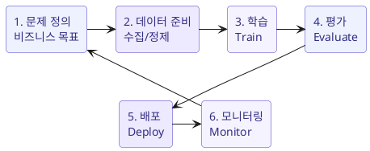

# 기능과 활용 (Prompt engineering, Grounding, RAG)

생성형 AI 의 출력 품질을 높이는 핵심 기법과, machine learning 이 가치를 더하는 방식을 다룹니다.

## Prompt engineering

**Prompt engineering** 은 모델에 주는 입력(prompt)을 설계해 더 정확하고 유용한 출력을 얻는 기법입니다.

기법 예시:

- **명확한 지시**: 역할, 형식, 길이, 톤을 구체적으로 지정.
- **컨텍스트 제공**: 배경 정보, 예시(few-shot)를 함께 제공.
- **단계 유도**: "단계별로 설명" 처럼 사고 과정을 유도.
- **제약 조건**: 금지 사항, 출력 스키마를 명시.

!!! tip "영향"
    좋은 prompt 는 fine-tuning 없이도 품질을 크게 개선합니다. 가장 비용 효율적인 개선 수단입니다.

## Grounding

**Grounding** 은 모델의 응답을 **신뢰할 수 있는 실제 데이터에 근거**하도록 만드는 것입니다.

- 모델이 학습 시점에 몰랐던 **최신/사내 정보**를 응답에 반영.
- fabrication(환각)을 줄이고, **정확성과 신뢰성**을 높임.
- 대표적 구현 방식이 **RAG**.

!!! note "비즈니스 요구와 grounding"
    "사내 정책 문서 기반으로만 답해야 한다", "최신 제품 카탈로그를 반영해야 한다" 같은 요구는 모두 grounding 요구사항입니다.

## RAG (Retrieval-Augmented Generation)

**RAG** 는 질문이 들어오면 **관련 문서를 검색(retrieve)** 해 prompt 에 함께 넣고, 그 근거를 바탕으로 모델이 응답을 **생성(generate)** 하는 패턴입니다.

RAG 의 이점:

- **최신성**: 모델 재학습 없이 최신 데이터 반영.
- **정확성/근거**: 출처를 함께 제시해 신뢰도 향상.
- **비용 효율**: fine-tuning 대비 저렴하고 유지관리가 쉬움.
- **보안**: 사내 데이터를 모델 학습에 넣지 않고 검색으로만 활용.

!!! info "관련 Microsoft 서비스"
    RAG 의 검색 계층은 흔히 **Azure AI Search** 로 구현하고, 오케스트레이션/모델은 **Microsoft Foundry** 에서 관리합니다.

## 데이터의 영향

생성형 AI/ML 솔루션의 품질은 데이터 품질에 크게 좌우됩니다.

| 요소 | 설명 |
| --- | --- |
| **Data type (유형)** | 정형/비정형, 텍스트/이미지 등 작업에 맞는 데이터인지 |
| **Data quality (품질)** | 정확성, 최신성, 완전성, 노이즈/중복 제거 |
| **Representative dataset (대표성)** | 실제 사용 집단을 고르게 반영해 편향을 줄임 |

!!! warning "Garbage in, garbage out"
    편향되거나 낮은 품질의 데이터는 편향/부정확한 출력을 낳습니다. 대표성 있는 고품질 데이터가 성능과 공정성의 전제입니다.

## Secure AI

- **Application security**: 프롬프트 인젝션, 오남용 방지, 출력 필터링(content safety).
- **Data security**: 민감 데이터 접근 통제, 저장/전송 암호화, 데이터가 모델 학습에 유출되지 않도록 관리.
- **Authentication (인증)**: 사용자/서비스 신원 확인 후 접근 허용. Microsoft Entra ID 기반 인증/인가.

!!! tip "왜 중요한가"
    AI 는 민감한 사내 데이터를 다루므로, 보안은 부가 기능이 아니라 **설계 전제**입니다. 접근 제어와 감사(audit)를 처음부터 포함해야 합니다.

## Machine learning 이 가치를 더하는 시나리오

생성형 AI 가 아니라 **전통 machine learning** 이 더 적합한 경우도 있습니다.

- 수치 **예측** (수요 예측, 가격 예측)
- **분류** (사기 탐지, 이탈 예측)
- **이상 탐지** (설비 고장 예측)

이런 정형 데이터 기반의 반복 예측/분류는 ML 이 더 정확하고 비용 효율적입니다.

### Machine learning lifecycle

모니터링 결과에 따라 재학습(retrain)하는 **반복 주기**입니다. **Azure Machine Learning** 은 이 lifecycle 전체(데이터, 학습, 평가, 배포, 모니터링)를 관리하는 플랫폼입니다.

## 요약

- **Prompt engineering** = 가장 싼 품질 개선 수단.
- **Grounding / RAG** = 사내/최신 데이터로 근거 있는 응답, 환각 감소.
- 데이터 **품질/대표성** 이 성능과 공정성을 좌우.
- 정형 예측/분류에는 전통 **ML** 이 더 적합.
