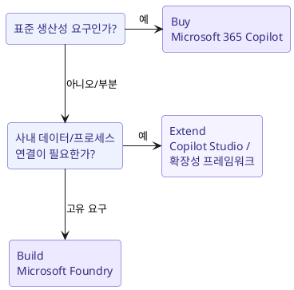

# Microsoft 365 Copilot & Microsoft Copilot

## Copilot 종류 구분

| 제품 | 대상/데이터 | 특징 |
| --- | --- | --- |
| **Microsoft Copilot** (무료/웹) | 공개 웹 데이터 기반 | 일반 채팅/생성. 조직 데이터 접근 없음 |
| **Microsoft 365 Copilot** (유료) | **Microsoft Graph** 기반 조직 데이터 + 웹 | 업무 문서/메일/회의 컨텍스트로 작동 |
| **Microsoft 365 Copilot Chat** | 조직 컨텍스트 채팅 (web/mobile) | 안전한 채팅 환경, 에이전트 사용 |

!!! note "가장 큰 차이"
    **Microsoft 365 Copilot** 은 로그인한 사용자가 **접근 권한을 가진 조직 데이터**(문서, 메일, 채팅, 회의)를 **Microsoft Graph** 를 통해 근거로 삼습니다. 기존 권한 모델을 그대로 존중하므로, 사용자가 볼 수 없는 데이터는 Copilot 도 사용하지 않습니다.

## Microsoft 365 앱 내 Copilot

Copilot 은 주요 M365 앱에 통합되어 각 앱의 맥락에서 작동합니다.

| 앱 | 대표 활용 |
| --- | --- |
| **Word** | 초안 작성, 재작성, 요약 |
| **Excel** | 데이터 분석, 수식/차트 제안, 인사이트 |
| **PowerPoint** | 문서 -> 슬라이드 생성, 디자인 |
| **Outlook** | 메일 요약/작성, 회신 초안 |
| **Teams** | 회의 요약, 액션 아이템 추출 |
| **OneNote/Loop** | 노트 요약, 아이디어 확장 |

## Copilot 내 Researcher 와 Analyst

Microsoft 365 Copilot 의 특화 에이전트:

- **Researcher**: 여러 출처(조직 데이터 + 웹)를 종합해 **심층 리서치 보고서**를 작성. 복잡한 주제 조사에 적합.
- **Analyst**: 원시 데이터를 받아 **데이터 분석/모델링**을 수행하고 인사이트를 도출. 스프레드시트/수치 분석에 적합.

!!! tip "선택 기준"
    - 정보 수집/종합/문헌 조사 -> **Researcher**
    - 수치 데이터 분석/계산/시각화 -> **Analyst**

## Microsoft Copilot Studio

**Copilot Studio** 는 코드 최소화(low-code)로 **커스텀 copilot/agent** 를 만드는 도구입니다.

- 사내 데이터 소스/시스템에 연결 (connectors, knowledge sources)
- 대화 흐름(topic), 트리거, 액션 정의
- Microsoft 365 Copilot 을 **확장(extend)** 하는 agent 배포

!!! example "유스케이스"
    "HR 정책 문의 챗봇", "IT 헬프데스크 agent" 처럼 사내 지식/프로세스에 특화된 assistant 를 빠르게 구축.

## Microsoft Graph

**Microsoft Graph** 는 Microsoft 365 전반의 데이터(사용자, 파일, 메일, 일정, Teams 등)와 관계를 노출하는 통합 API/데이터 계층입니다.

- Microsoft 365 Copilot 이 조직 컨텍스트를 이해하는 **근거(grounding) 원천**.
- 기존 **권한/보안 경계**를 준수 (사용자 접근 권한 그대로 적용).
- **Graph connectors** 로 외부 시스템 데이터를 Graph 에 인덱싱해 Copilot 이 활용하도록 확장 가능.

## Build / Buy / Extend 판단

- **Buy**: 이미 제공되는 기능으로 충분 -> 라이선스만 도입, 가장 빠름.
- **Extend**: 표준 Copilot + 사내 지식 연결 -> **Copilot 365 확장성 프레임워크**(agents, plugins, Graph connectors)로 확장.
- **Build**: 완전히 고유한 요구/제품 내장 -> **Microsoft Foundry** 로 직접 개발.

## 통합 Microsoft AI 솔루션의 이점

- **Risk mitigation (위험 완화)**: 개인 ChatGPT 계정 등 shadow AI 대신, 조직이 관리하는 안전한 환경 제공.
- **Safety**: content safety, 데이터 경계, 감사 로그가 기본 내장.
- **일관된 신원/보안**: Microsoft Entra ID 로 통합 인증/인가.
- **데이터 보호**: 조직 데이터가 기반 모델 학습에 사용되지 않음 (commercial data protection).

!!! warning "Shadow AI 문제"
    직원이 개인 계정으로 외부 AI 를 쓰면 사내 정보가 통제 밖으로 유출될 수 있습니다. 조직이 승인한 통합 솔루션 제공이 위험을 크게 줄입니다.

## 요약

- **Microsoft 365 Copilot** = Microsoft Graph 기반, 권한을 존중하는 업무 생산성 AI.
- **Copilot Studio** = low-code 로 커스텀 agent 제작(Extend).
- **Researcher**(리서치) / **Analyst**(데이터 분석) 구분.
- 통합 솔루션은 shadow AI 위험을 줄이고 안전/보안을 기본 제공.
