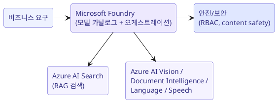

# Microsoft Foundry & Foundry Tools

## Microsoft Foundry 란

**Microsoft Foundry** (Azure AI Foundry) 는 생성형 AI 솔루션을 **개발, 테스트, 배포, 운영**하는 통합 플랫폼입니다. PoC 에서 production 까지 하나의 환경에서 확장할 수 있습니다.

주요 이점:

- **Scalability (확장성)**: PoC -> 대규모 production 앱으로 손쉽게 확장.
- **Security (보안)**: RBAC, networking, 규정 준수, 데이터 보호 내장.
- **모델 카탈로그**: OpenAI, Microsoft, 오픈소스 등 다양한 모델 선택/비교.
- **Lifecycle 관리**: 모델 학습, 평가, 배포, 모니터링 통합.
- **Grounding/RAG, agents, 멀티모달** 워크플로 지원.

!!! note "Foundry 를 고르는 이유"
    "사내 데이터 기반 생성형 AI 를 처음부터 만들되, 거버넌스/보안/확장성을 갖춘 엔터프라이즈 환경이 필요하다" 는 요구에 대한 표준 답입니다.

## Foundry Tools (핵심 서비스)

Foundry Tools 는 특정 AI 작업에 특화된 서비스 모음입니다. 유스케이스에 맞게 골라 씁니다.

| 서비스 | 용도 | 대표 유스케이스 |
| --- | --- | --- |
| **Microsoft Foundry** | 생성형 AI 개발/운영 플랫폼 | 커스텀 copilot, RAG 앱 |
| **Azure AI Search** | 인덱싱 + 검색 (knowledge mining) | RAG 검색 계층, 문서 검색 |
| **Azure AI Vision** | 이미지/영상 분석 | 이미지 분류, 객체/텍스트 인식 |
| **Azure AI Document Intelligence** | 문서에서 구조화 데이터 추출 | 스캔 송장/양식 자동 처리 |
| **Azure AI Language** | 텍스트 분석 | 감정 분석, 개체 추출, 요약 |
| **Azure AI Speech** | 음성 <-> 텍스트 | 통화 전사, 음성 명령 |

!!! tip "유스케이스 -> 서비스 매핑 예시"
    - "매월 수천 건의 스캔 송장에서 항목을 자동 추출" -> **Azure AI Document Intelligence**
    - "여러 시스템에 흩어진 문서를 검색/지식 마이닝" -> **Azure AI Search**
    - "제품 이미지 자동 분류/태깅" -> **Azure AI Vision**
    - "사내 지식 기반 Q&A (RAG)" -> **Azure AI Search + Microsoft Foundry**

## 비즈니스 요구에 맞는 모델 선택

Foundry 의 모델 카탈로그에서 선택할 때 고려 사항:

- **작업 유형**: 텍스트/이미지/멀티모달, reasoning 필요 여부.
- **품질 vs 비용/지연**: 큰 모델은 강력하지만 비싸고 느림.
- **컨텍스트 길이**: 긴 문서를 다루면 큰 context window 필요.
- **배포 지역/규정**: 데이터 거주(residency), 규정 준수 요구.

## Foundry 의 보안/거버넌스

- **RBAC** 로 리소스 접근 제어, Entra ID 통합 인증.
- **Content safety** 로 유해 콘텐츠 입력/출력 필터링.
- **네트워크 격리**(private endpoint), 데이터 암호화.
- 사용/비용 **모니터링**과 감사.

## 요약

- **Microsoft Foundry** = 엔터프라이즈용 생성형 AI 구축/운영 플랫폼 (scalability + security).
- **Azure AI Search** = knowledge mining / RAG 검색.
- **Azure AI Vision / Document Intelligence / Language / Speech** = 특화 작업.
- 모델 선택은 **작업 유형 + 품질/비용/지연 + 규정** 을 함께 고려.

!!! info "출처"
    - [Microsoft Learn - Microsoft Foundry documentation](https://learn.microsoft.com/en-us/azure/ai-foundry/)
    - [Microsoft Learn - Foundry Tools](https://learn.microsoft.com/en-us/azure/ai-services/what-are-ai-services)
    - [Microsoft Learn - Azure AI Search documentation](https://learn.microsoft.com/en-us/azure/search/)
    - [Microsoft Learn - Model catalog and collections in Microsoft Foundry](https://learn.microsoft.com/en-us/azure/ai-foundry/how-to/model-catalog-overview)
