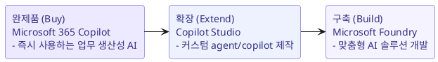

# Domain 2 - Microsoft AI 앱/서비스의 이점, 기능, 기회

**비중 35-40%** - Microsoft 의 AI 제품군을 비즈니스 유스케이스에 매핑하는 능력을 다룹니다.

## 이 도메인의 구성

| 문서 | 내용 |
| --- | --- |
| [Microsoft 365 Copilot](01-copilot.md) | Copilot 종류/버전, M365 앱 통합, Copilot Studio, Microsoft Graph, Researcher/Analyst, build-buy-extend |
| [Microsoft Foundry & Foundry Tools](02-foundry.md) | Microsoft Foundry, Azure AI Search, Azure AI Vision, 모델 선택 |

## 두 갈래로 나눠 보기

!!! abstract "핵심 판단"
    - **Buy**: 표준 업무 생산성 -> **Microsoft 365 Copilot** 을 그대로 도입.
    - **Extend**: 사내 데이터/프로세스 연결이 필요 -> **Copilot Studio** 로 확장.
    - **Build**: 고유한 요구/제품에 내장 -> **Microsoft Foundry** 로 직접 구축.

!!! info "출처"
    [Microsoft 365 Copilot](https://learn.microsoft.com/en-us/copilot/microsoft-365/), [Copilot Studio](https://learn.microsoft.com/en-us/microsoft-copilot-studio/), [Azure AI Foundry](https://learn.microsoft.com/en-us/azure/ai-foundry/)
