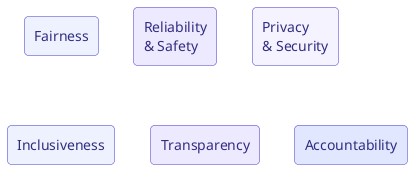

# Responsible AI

## 왜 중요한가

AI 는 사람과 비즈니스에 큰 영향을 주므로, **공정하고 안전하며 신뢰할 수 있게** 사용해야 합니다. Responsible AI 는 평판/법적 위험을 줄이고, 사용자 신뢰를 확보하며, 규정 준수를 보장합니다.

## Microsoft Responsible AI 6대 원칙

| 원칙 | 의미 |
| --- | --- |
| **Fairness (공정성)** | 모든 사용자를 공평하게 대하고 편향을 최소화 |
| **Reliability & Safety (신뢰성과 안전)** | 예측 가능하고 안전하게 동작, 오류/피해 방지 |
| **Privacy & Security (개인정보와 보안)** | 데이터를 보호하고 프라이버시를 존중 |
| **Inclusiveness (포용성)** | 다양한 사용자와 능력을 고려해 접근성 확보 |
| **Transparency (투명성)** | AI 의 동작/한계를 이해할 수 있게 공개 |
| **Accountability (책임성)** | AI 결과에 대해 사람이 책임을 짐 |

!!! note "Transparency 와 Accountability 의 관계"
    - **Transparency**: 시스템이 어떻게/왜 그런 결과를 내는지 설명 가능해야 함.
    - **Accountability**: 최종 책임은 항상 **사람/조직** 에게 있음. AI 에 책임을 전가하지 않음.

## Governance (거버넌스)

Responsible AI 를 실제로 지키려면 조직 차원의 통제 구조가 필요합니다.

- **정책/표준 수립**: 허용/금지 사용 사례, 데이터 사용 규칙, 검토 절차.
- **위험 평가**: 사용 사례별 위험도 분류와 승인 절차.
- **모니터링/감사**: 사용 로그, 품질/편향 모니터링, 사고 대응.
- **교육**: 직원 대상 responsible AI 교육.

## AI Council (AI 위원회)

**AI council** 은 조직의 AI 전략과 거버넌스를 이끄는 **교차 기능(cross-functional) 조직** 입니다.

- 구성: 경영진, IT/보안, 법무/컴플라이언스, 데이터, 현업 부서 대표.
- 역할:
    - AI 전략과 우선순위 방향 설정
    - 정책/표준 승인 및 감독(oversight)
    - 부서 간 정렬(cross-functional alignment)
    - 위험/윤리 이슈 심의

!!! tip "AI council vs adoption team"
    - **AI council**: 전략/거버넌스/oversight (무엇을, 어떤 규칙으로).
    - **Adoption team**: 실제 확산/교육/변화관리 (어떻게 퍼뜨릴지). 다음 문서 참고.

## 요약

- Responsible AI = **6대 원칙**(fairness, reliability & safety, privacy & security, inclusiveness, transparency, accountability).
- 책임은 항상 **사람**에게 (accountability).
- **Governance** 로 정책/위험/감사를 제도화.
- **AI council** 이 전략과 oversight 를 담당.
