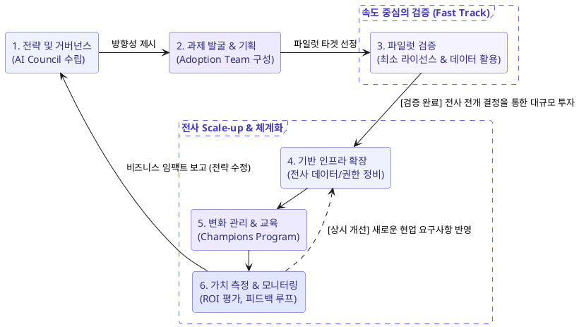

# AI 도입 계획 (Adoption)

## 도입은 기술이 아니라 변화 관리

AI 도입의 성패는 도구가 아니라 **사람과 프로세스** 에 달려 있습니다. 조직 전반에 확산하려면 체계적인 change management 가 필요합니다.

## Adoption team (도입 팀)

- 도입을 **실행**하는 팀 (거버넌스를 정하는 AI council 과 구분).
- 역할: 파일럿 운영, 교육/온보딩, 유스케이스 발굴, 성공 측정, 피드백 수집.
- 경영진 후원(sponsorship)과 현업 참여를 연결.

## AI Champions program (챔피언 프로그램)

**AI champions** 는 각 부서의 얼리어답터/열성 사용자로, 동료의 도입을 돕습니다.

- 부서 내 실제 유스케이스를 발굴하고 공유.
- 동료 교육, 질문 응대, 모범 사례 전파.
- adoption team 과 현업 사이의 가교 역할.

!!! tip "왜 효과적인가"
    하향식 지시보다, 같은 부서 동료(champion)의 실제 사례와 지원이 저항을 줄이고 확산을 가속합니다.

## 도입 장벽 (Common barriers)

| 장벽 | 대응 |
| --- | --- |
| **신뢰 부족/두려움** | 안전성/데이터 보호 설명, 성공 사례 공유 |
| **기술 역량 부족** | 교육, prompt 가이드, champion 지원 |
| **명확한 유스케이스 부재** | 부서별 고가치 유스케이스 발굴 |
| **데이터 품질/접근 문제** | 데이터 정비, 권한 정리 |
| **거버넌스/보안 우려** | 정책 수립, responsible AI 원칙 적용 |
| **변화 저항** | 경영진 후원, champion, 점진적 확산 |

## 데이터/보안/프라이버시/비용 영향

도입 시 반드시 함께 검토할 영향:

- **데이터**: Copilot 은 기존 **권한 모델**을 따르므로, 과도하게 공유된(over-shared) 데이터가 노출될 수 있음 -> 사전 권한 정비 필요.
- **보안**: 인증/인가, 감사 로그, shadow AI 차단.
- **프라이버시**: 개인정보 처리 규정 준수, 데이터 거주(residency).
- **비용**: 라이선스/토큰 비용, ROI 측정.

!!! warning "Over-sharing 위험"
    Microsoft 365 Copilot 도입 전, SharePoint/OneDrive 등의 **접근 권한 정비**가 중요합니다. 사용자가 원래 볼 수 있던 데이터라면 Copilot 도 활용하므로, 과공유된 민감 데이터가 요약/검색으로 드러날 수 있습니다.

## 라이선스 및 구독 모델

### Microsoft 365 Copilot 라이선스

| 모델 | 설명 |
| --- | --- |
| **Microsoft 365 구독 포함** | 일부 Copilot 기능이 구독에 포함 |
| **월 구독 (per-user)** | Microsoft 365 Copilot 을 사용자당 월 단위로 추가 |
| **Pay-as-you-go** | 사용량 기반 과금 (예: Copilot Studio 메시지, agent 사용) |

### Foundry Tools 구독 모델

| 모델 | 설명 | 적합 상황 |
| --- | --- | --- |
| **Pay-as-you-go** | 사용한 만큼만 과금 | 초기/변동 워크로드, PoC |
| **Commitment tier** | 사전 약정으로 할인 단가 | 대규모/예측 가능한 지속 사용 |

!!! tip "비용 최적화"
    시작은 **pay-as-you-go** 로 사용량을 파악하고, 안정적으로 규모가 커지면 **commitment tier** 로 전환해 단가를 낮춥니다.

## 도입 여정 개요

## 요약

- **AI council** = 전략/거버넌스, **adoption team** = 실행, **champions** = 부서 확산.
- 도입 전 **데이터 권한 정비**(over-sharing 방지)가 핵심.
- Copilot 라이선스: 구독 포함 / 월 구독 / pay-as-you-go.
- Foundry Tools: **pay-as-you-go** 로 시작, 규모가 크면 **commitment tier**.

!!! info "출처"
    - [Microsoft Copilot Adoption - Adoption planning](https://adoption.microsoft.com/en-us/copilot/)
    - [Microsoft Learn - Microsoft 365 Copilot adoption guide](https://learn.microsoft.com/en-us/microsoft-365/copilot/microsoft-365-copilot-enablement-resources)
    - [Microsoft Learn - Get ready for Microsoft 365 Copilot](https://learn.microsoft.com/en-us/microsoft-365/copilot/microsoft-365-copilot-setup)
    - [Microsoft Learn - Microsoft 365 Copilot licensing options](https://learn.microsoft.com/en-us/microsoft-365/copilot/which-copilot-for-your-organization)
